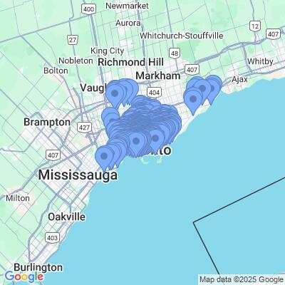

# toronto-bikeshare-2024


## Installation


### Option 1: Run as script:

```shell
# 1. clone repo
$ git clone git@github.com:ConstCorrectness/toronto-bikeshare-2024.git && cd toronto-bikeshare-2024

# 2. convert .ipynb to .py script
$ jupyter nbconvert --to script main.ipynb

# 3. run as script
$ python main.py
```

### Option 2: Run as notebook:
```shell
# 1. clone repo
$ git clone git@github.com:ConstCorrectness/toronto-bikeshare-2024.git && cd toronto-bikeshare-2024

# 2. convert .ipynb to .py script
$ jupyter notebook main.ipynb

```
---




