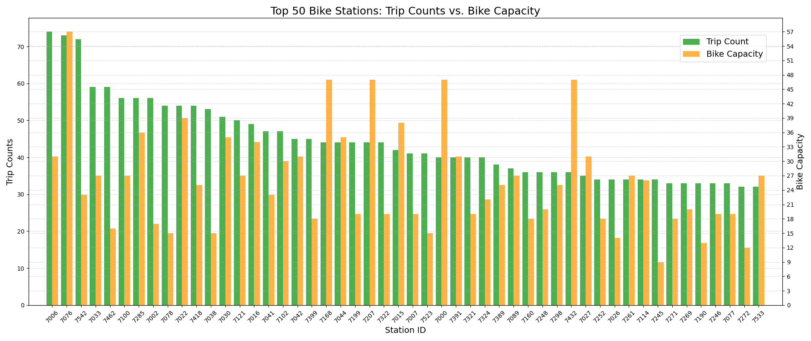

<p align="center">
  <h1>🚴 Toronto Bikeshare Analysis (2023) 🚴</h1>
</p>

<p align="center">
  
  
  
  
  
</p>

## 📌 About the Project 
This project aims to analyze Toronto’s Bike Share activity in 2024 to uncover key trends that can inform urban planning decisions, particularly the potential expansion of bike lane infrastructure. The project primarily focuses on **data cleaning, visualization, and exploratory analysis** to find valuable insights into when, and where people are using Toronto’s Bike Share program, ultimately supporting evidence-based decisions for future cycling infrastructure investments.

## 📊 Datasets Used
The project uses **bike-sharing data** from Toronto’s public dataset.

| Dataset                        | Description                                      |
|--------------------------------|--------------------------------------------------|
| `station_information.csv`      | List of bike stations (ID, name, lat/lon).       |
| `station_status.csv`           | Bike availability at each station.               |
| `bikeshare-ridership-2023/`    | Monthly trip data for 2023.                      |

## 🛠️ Installation & Setup

### Option 1: Run as script:
```shell
# 1. clone repo
$ git clone git@github.com:ConstCorrectness/toronto-bikeshare-2024.git && cd toronto-bikeshare-2024

# 2. convert .ipynb to .py script
$ jupyter nbconvert --to script main.ipynb

# 3. run as script
$ python main.py
```
### 
### Option 2: Run as notebook:
```shell
# 1. clone repo
$ git clone git@github.com:ConstCorrectness/toronto-bikeshare-2024.git && cd toronto-bikeshare-2024

# 2. convert .ipynb to .py script
$ jupyter notebook main.ipynb

```
---

## 📈 Results & Visualizations
<p align="center">
  
  
  
  
  
  
  
  

  
  
  
</p>

<p align="center">
  The heatmap is: <a href="https://constcorrectness.github.io/toronto-bikeshare-2024/heatmap.html">here</a>
</p>

## 📉 Summary Findings 📈

# Summary of Findings 

## Objectives: 
The original intent of this project was to analyze Toronto Bikeshare program 2023 dataset to derive insights as to when, where, and how long riders were utilizing this service so as to better inform city planners for future bicycling lanes investments.

We used a variety of modules in Jupyter notebook such as Python, Pandas, Matplotlib, NumPy, Seaborn, Folium, as well as pulling data from various sources like Google maps. We arrived at the following conclusions about Toronto’s bikeshare program in 2023:

### Peak Usage Times:

Based on the data plotted on [fig3](/images/fig3.png) and further supported by [fig7](/images/fig7.png) (as well as [fig2's](/images/fig2.png) pie chart illustration), there are *clear peaks in bike usage during weekday mornings (7-9am), followed by evenings (5-7pm), which is attributable to common commuting hours.* This is an obvious *indication that the bikeshare system is heavily used by commuters, underscoring a need for more dedicated bike lanes during peak traffic times to enhance safety and efficiency standards of Torontonians.*

### Casual vs Annual Members:

It’s clear from [fig1](/images/fig1.png) bar chart that the overwhelming 90%+ of bikeshare program trips are conducted by casual members who do not have a bikeshare membership. Even more intriguing, besides annual members being such a small statistical group, they tend use the service more in the winter & spring months than in summer & fall months. This could indicate that the *bikeshare program may not be affordable enough to reach a higher conversion rate as well as market penetration in the public transportation space.* Therefore, city planners/administrators may investigate into pricing strategies to entice annual membership enrollment.

### High-Demand Stations:
Based on the bar chart shown in [fig8](/images/fig8.png) that highlights the bike capacity vs. trips taken compared to each bike station, it’s evident that majority of the high-volume stations have insufficient bike capacity. This imbalance is signaling the need for *increasing bike capacity at high-demand stations* and perhaps it would be wise to *re-direct some of the over-capacity bikes from other stations to the more underserved stations.*

### Trip travel durations:

From [fig6](/images/fig6.png) shows that an *overwhelming density of trips taken are in the range of 7-10 minutes, forming a right skew in the distribution of trips taken.* It would only make sense that *these short trips are taken in the downtown core where people would require subways, buses, or bikes to commute to work for short trip durations.* This is further supported by the [interactive heatmap](https://constcorrectness.github.io/toronto-bikeshare-2024/heatmap.html) showing *the high density of trips taken are in the downtown core.* Notable areas that demonstrated high volume of bike trips and should warrant attention: Distillery District, Union Station, Financial District core (eg. St Andrew station, King St & University, Welling St W & University), from College Station all the way to Toronto Eaton Centre, and lastly Yonge & Bloor area.

---

## Recommendations:

1. Add new bike lanes in already high-demand areas, especially near top-performing stations that would only get busier as Toronto’s population grows.

2. Seek expansion of bike lane coverage during weekday’s peak commuting hours in the morning and evening as subway stations are always overcrowded.

3. Increase bike capacity at busy stations and re-distribute bikes from underutilized ones.

4. Launch promotional campaigns to attract more casual users, thereby increasing overall usage.

5. Seek partnerships with private enterprises or large community groups to further promote and draw attention to the Bikeshare program.
The municipal government should monitor and develop policies that are not only bike commuting-friendly but also incentivize its citizenry to seek biking as an affordable, convenient, and safe method of transportation which would only generate long-term benefits to the city. Therefore these insights and recommendations aim to support the city’s proposal for expansion of bike lanes and procuring more bikes, ensuring a better bikeshare system. 
	


## 🗺️ Mapping Bike Routes

This project includes **geospatial analysis** using Folium to map bike routes.

Example route visualization:
```python
import folium

m = folium.Map(location=[sample_df['lat_start'].mean(), sample_df['lon_start'].mean()], zoom_start=10)
heat_data = sample_df[['lat_start', 'lon_start']].values.tolist()

HeatMap(heat_data).add_to(m)

# output heapmap to .html
m.save("docs/heatmap.html")
```

## Main Contributors:
- [Gwen Seymour](https://github.com/Gwen1987) (coder, data cleaning, visualizations)
- [Peter Lin](https://github.com/bluejays101) (coding, visualizations, writeups)
- [Rob Ranieri](https://github.com/ConstCorrectness) (coder, data wrangling, visualizations)


### 📜 License
This project is licensed under the MIT License. See the [LICENSE](LICENSE) file for details.


### 🙌 Acknowledgments
- Data Source: [Toronto Bike Share](https://bikesharetoronto.com/)
- Google Maps API for route visualization

