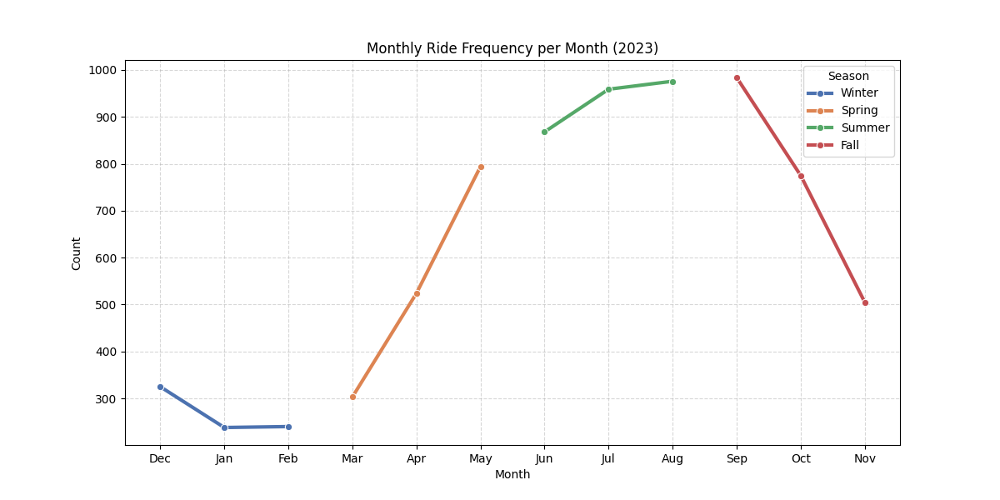
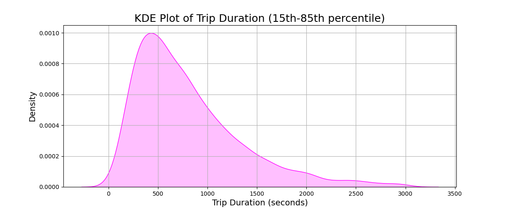

<p align="center">
  <h1>🚴 Toronto Bikeshare Analysis (2023) 🚴</h1>
</p>

<p align="center">
  
  
  
  
  
</p>

## 📌 About the Project 
This project aims to analyze Toronto’s Bike Share activity in 2024 to uncover key trends that can inform urban planning decisions, particularly the potential expansion of bike lane infrastructure. The project primarily focuses on **data cleaning, visualization, and exploratory analysis** to find valuable insights into when, and where people are using Toronto’s Bike Share program, ultimately supporting evidence-based decisions for future cycling infrastructure investments.

## 📊 Datasets Used
The project uses **bike-sharing data** from Toronto’s public dataset.

| Dataset                        | Description                                      |
|--------------------------------|--------------------------------------------------|
| `station_information.csv`      | List of bike stations (ID, name, lat/lon).       |
| `station_status.csv`           | Bike availability at each station.               |
| `bikeshare-ridership-2023/`    | Monthly trip data for 2023.                      |

## 🛠️ Installation & Setup

### Option 1: Run as script:
```shell
# 1. clone repo
$ git clone git@github.com:ConstCorrectness/toronto-bikeshare-2024.git && cd toronto-bikeshare-2024

# 2. convert .ipynb to .py script
$ jupyter nbconvert --to script main.ipynb

# 3. run as script
$ python main.py
```
### 
### Option 2: Run as notebook:
```shell
# 1. clone repo
$ git clone git@github.com:ConstCorrectness/toronto-bikeshare-2024.git && cd toronto-bikeshare-2024

# 2. convert .ipynb to .py script
$ jupyter notebook main.ipynb

```
---

## 📈 Results & Visualizations
<p align="center">
  
  
  
  
  
  
  
  
</p>

<p align="center">
The heatmap is at:
</p>
## 🗺️ Mapping Bike Routes

This project includes **geospatial analysis** using Folium to map bike routes.

Example route visualization:
```python
import folium

m = folium.Map(location=[sample_df['lat_start'].mean(), sample_df['lon_start'].mean()], zoom_start=10)
heat_data = sample_df[['lat_start', 'lon_start']].values.tolist()

HeatMap(heat_data).add_to(m)

# output heapmap to .html
m.save("docs/heatmap.html")
```

## Main Contributors:
- [Rob Raineri](https://github.com/ConstCorrectness) (coder, data wrangling, visualizations)
- [Gwen Seymour](https://github.com/Gwen1987) (coder, data cleaning, visualizations)
- [Peter Lin](https://github.com/bluejays101) (coding, visualizations, writeups)


### 📜 License
This project is licensed under the MIT License. See the [LICENSE](LICENSE) file for details.


### 🙌 Acknowledgments
- Data Source: [Toronto Bike Share](https://bikesharetoronto.com/)
- Google Maps API for route visualization

